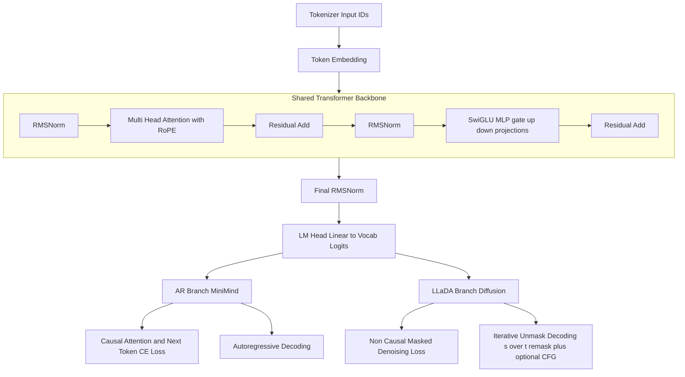

# Nano-LLaDA


`Nano-LLaDA` is a lightweight discrete diffusion language model project. The current release is **v0.1.0** with about **30M** parameters. It builds on open-source `minimind` and `tiny-diffusion`, and provides a full AR + Diffusion pipeline for pretraining, SFT, and evaluation.

For the Chinese version of this document, see `README_cn.md`.

## Project Status

- Current version: `v0.1.0`
- Parameter scale: `~30M`
- Current capability: initial engineering reproduction of the LLaDA 1.0 idea
- Progress: after SFT, `Nano-LLaDA` has gained basic question-answering ability; training and tuning are still ongoing for better results.
- Note: this implementation is not yet a strict 1:1 reproduction of every technical detail from the original LLaDA 1.0 report. We are continuously refining components.
- Training tracks:
  - AR (MiniMind-style causal LM)
  - Diffusion (LLaDA-style masked denoising)

## Overall Approach

We reuse `minimind` for base model construction, dataset format, and tokenizer. We first pretrain an autoregressive model, then build a parameter-matched LLaDA model inspired by LLaDA 2.0 training techniques, initialize it from AR pretrained weights, and continue with SFT and evaluation.

## LLaDA 1.0 / 2.0 Module Mapping

The current `Nano-LLaDA` release implements the core diffusion modeling mechanism from `LLaDA 1.0`, and also introduces several training enhancements proposed in `LLaDA 2.0`. To avoid conceptual confusion, the module mapping is listed below.

### 1. LLaDA 1.0 Core Mechanisms (Implemented)

- Bidirectional Transformer Mask Predictor
  - Attention is configured as `is_causal=False`
  - Masked tokens are predicted from full-context conditioning
- `iid_t` Masking (Eq.3)
  - Sample `t ~ Uniform(eps, 1-eps)` for each sample
  - Independently mask each token with `Bernoulli(t)`
  - Ensure at least one token is masked
- `1/t`-weighted Masked Cross Entropy
  - Loss is computed only on masked tokens
  - Uses Eq.3-style Monte Carlo approximation
- Iterative Remasking Sampling
  - Predict all masked tokens at each step
  - Remask lowest-confidence tokens each step
  - Use `s/t` ratio to align with the reverse process
  - Optional unsupervised CFG in Eq.(16) via `--gen-cfg-scale` (default enabled)

Enable with:

```bash
--mask-schedule iid_t
--repeat-penalty-weight 0
```

This mode is the closest to the original `LLaDA 1.0` setting.

### 2. LLaDA 2.0 Training Enhancements (Partially Implemented)

The current release includes several stabilization and continual pretraining strategies from `LLaDA 2.0`:
Some items in this section are not fully tested in end-to-end training yet.

- WSD (Warmup-Stable-Decay) Block Schedule
  - WSD in this repo now refers only to block-size warmup/stable/decay
  - Old mask-ratio WSD schedule has been deprecated to avoid confusion
  - When `--mask-schedule wsd` is enabled, training uses BDLM/MDLM-style masked CE with diffusion time weight `alpha'(t)/(1-alpha(t))`
- Block Curriculum
  - Gradually increase block size during diffusion training
  - Then shrink block size back for efficiency
- Time-Weighted Loss
  - Uses diffusion-time weight `alpha'(t)/(1-alpha(t))`
  - Replaces the `1/t` approximation form
- Document-level Attention Mask
  - Builds document-segmented attention using EOS boundaries
  - Restricts attention propagation across documents
- Eq.(5) Block Diffusion SFT (optional switch, default off)
  - Block-wise masked denoising for SFT with prompt conditioning
  - Keeps clean prefix blocks and denoises a sampled noisy block
- CAP (Confidence-Aware Parallel) auxiliary loss (optional switch, default off)
  - Adds confidence objective `L = LSFT + lambda * Lconf`
  - Minimizes entropy on correctly predicted masked tokens
- Top-k checkpoint merging (optional switch, default off)
  - Tracks top-k validation checkpoints during diffusion pretraining
  - Saves an averaged merged checkpoint at the end

Example flags:

```bash
--mask-schedule wsd
--use-block-curriculum
--time-weighted-loss
--use-doc-attention-mask
```

Additional LLaDA 2.0 optional flags (all default OFF, so default behavior remains 1.0-like):

```bash
# diffusion pretraining
--llada2-topk-merge --llada2-topk-merge-k 3

# diffusion SFT
--llada2-enable-block-diffusion --llada2-block-size 32
--llada2-alpha-min 0.05 --llada2-alpha-max 0.95
--llada2-enable-cap --llada2-cap-lambda 0.1
--llada2-enable-complementary-masking
--llada2-quantize-effective-length

# diffusion decoding/eval
--llada2-enable-parallel-decoding
```

Safety guard: when running 1.0-style paths (`--mask-schedule iid_t` in pretraining or SFT without `--llada2-enable-block-diffusion`), these 2.0 switches are automatically disabled.
Note: `--llada2-enable-complementary-masking` is treated as a LLaDA2.0 path and requires `--llada2-enable-block-diffusion`.

## Shared Architecture (AR + LLaDA)



## Environment Setup

```bash
pip install uv
uv sync
```

## Dataset Setup

```bash
pip install modelscope
mkdir -p dataset && modelscope download --dataset gongjy/minimind_dataset pretrain_hq.jsonl --local_dir ./dataset
mkdir -p dataset && modelscope download --dataset gongjy/minimind_dataset sft_mini_512.jsonl --local_dir ./dataset
```

## Training and Evaluation

### 1. AR Pretraining

```bash
uv run python -m scripts.train.train_pretrain \
  --data ./dataset/pretrain_hq.jsonl \
  --jsonl-field text \
  --tokenizer-dir . \
  --run-name minimind_pretrain \
  --hidden-size 512 \
  --num-hidden-layers 8 \
  --num-attention-heads 8 \
  --max-seq-len 256 \
  --epochs 1 \
  --batch-size 96
```

### 2. AR Evaluation

```bash
uv run python -m scripts.eval.eval_minimind \
  --checkpoint weights/minimind_pretrain_state_dict.pt \
  --tokenizer-dir . \
  --prompt "请介绍你自己。" \
  --max-new-tokens 200
```

### 3. Nano-LLaDA Pretraining

The command below currently runs in `LLaDA 1.0` style. The main `LLaDA 2.0`-inspired part is AR-to-diffusion initialization (`--init-from-minimind`) for continual pretraining.

```bash
uv run python -m scripts.train.diffusion \
  --train \
  --use-tokenizer \
  --data ./dataset/pretrain_hq.jsonl \
  --inference-rope-scaling \
  --learning-rate 4e-4 \
  --warmup-steps 2000 \
  --min-lr-ratio 0.025 \
  --mask-schedule iid_t \
  --repeat-penalty-weight 0 \
  --init-from-minimind weights/minimind_pretrain_state_dict.pt \
  --run-name diffusion_from_ar_eq3 \
  --early-stop-patience 5 \
  --early-stop-min-delta 0.001 \
  --max-iters 40000 \
  --batch-size 96
```

LLaDA 2.0-style optional pretraining switch (default off):

```bash
--llada2-topk-merge --llada2-topk-merge-k 3
```

### 4. Nano-LLaDA Evaluation

```bash
uv run python -m scripts.eval.eval_diffusion \
  --checkpoint weights/diffusion_no_v1.pt \
  --tokenizer-dir . \
  --seq-len 256 \
  --prompt "请介绍你自己。" \
  --max-new-tokens 200 \
  --gen-steps 64 \
  --gen-cfg-scale 1.5
```

LLaDA 2.0-style optional decoding switch:

```bash
--llada2-enable-parallel-decoding
```

`--gen-cfg-scale` is enabled by default (`1.5`). Set it to `0` to disable CFG.
Generation now auto-stops when `<|im_end|>` or `eos` is produced.

## Nano-LLaDA Pretraining Loss (Chinese Dataset)

The following are diffusion pretraining loss curves on the Chinese dataset:

- `25k` steps:


- `40k` steps:


### 5. AR SFT

```bash
uv run python -m scripts.train.train_sft_minimind \
  --data dataset/sft_mini_512.jsonl \
  --tokenizer-dir . \
  --load-from weights/minimind_pretrain_state_dict.pt \
  --run-name minimind_sft \
  --max-seq-len 512 \
  --batch-size 96 \
  --epochs 2
```

### 6. Nano-LLaDA SFT

```bash
uv run python -m scripts.train.train_sft_diffusion \
  --data dataset/sft_mini_512.jsonl \
  --tokenizer-dir . \
  --load-from weights/diffusion_from_ar_eq3_3g_en.pt \
  --run-name diffusion_sft \
  --max-seq-len 512 \
  --batch-size 96 \
  --epochs 3
```

LLaDA 2.0-style optional SFT switches (keep disabled if you want 1.0 behavior):

```bash
uv run python -m scripts.train.train_sft_diffusion \
  --data dataset/sft_mini_512.jsonl \
  --tokenizer-dir . \
  --load-from weights/diffusion_from_ar_eq3_3g_en.pt \
  --run-name diffusion_sft_llada2 \
  --max-seq-len 512 \
  --batch-size 96 \
  --epochs 3 \
  --llada2-enable-block-diffusion \
  --llada2-block-size 32 \
  --llada2-alpha-min 0.05 \
  --llada2-alpha-max 0.95 \
  --llada2-enable-cap \
  --llada2-cap-lambda 0.1 \
  --llada2-enable-complementary-masking \
  --llada2-quantize-effective-length
```

### 7. Nano-LLaDA DPO (Independent Feature)

Following Section 5.3 of the LLaDA 2.0 report, diffusion DPO is implemented by replacing exact conditional log-likelihood with single-sample Block Diffusion ELBO estimates.
The implementation is a separate entrypoint: `scripts/train/train_dpo_diffusion.py`, and does not change existing pretraining/SFT paths.

Supported preference `.jsonl` row formats:

```json
{"prompt":"...", "chosen":"...", "rejected":"..."}
{"system":"...", "instruction":"...", "chosen":"...", "rejected":"..."}
{"messages":[{"role":"user","content":"..."}], "chosen":"...", "rejected":"..."}
{"chosen":[{"role":"user","content":"..."},{"role":"assistant","content":"..."}], "rejected":[{"role":"user","content":"..."},{"role":"assistant","content":"..."}]}
```

Training example:

```bash
uv run python -m scripts.train.train_dpo_diffusion \
  --data dataset/dpo_pairs.jsonl \
  --tokenizer-dir . \
  --load-from weights/diffusion_sft.pt \
  --run-name diffusion_dpo \
  --max-seq-len 512 \
  --batch-size 64 \
  --epochs 1 \
  --dpo-beta 0.1 \
  --llada2-block-size 32 \
  --llada2-alpha-min 0.05 \
  --llada2-alpha-max 0.95
```

Notes:
- `--reference-from` defaults to `--load-from` (frozen post-SFT model as reference).
- If `--learning-rate` is not set, it is inferred from the SFT checkpoint as `learning_rate * final_lr_ratio` when metadata is available.

### 8. Single-Prompt SFT Evaluation

AR SFT:
```bash
uv run python -m scripts.eval.eval_sft_one_prompt \
  --prompt "你好，请介绍你自己。" \
  --tokenizer-dir . \
  --minimind-checkpoint weights/minimind_sft_state_dict.pt \
  --seq-len 512 \
  --max-new-tokens 128 \
  --gen-steps 64 \
  --gen-cfg-scale 1.5
```

Nano-LLaDA SFT:
```bash
uv run python -m scripts.eval.eval_sft_one_prompt \
  --prompt "你好，请介绍你自己。" \
  --tokenizer-dir . \
  --diffusion-checkpoint weights/diffusion_sft_state_dict.pt \
  --seq-len 512 \
  --max-new-tokens 128 \
  --gen-steps 64 \
  --gen-cfg-scale 1.5
```

AR + Nano-LLaDA comparison:
```bash
uv run python -m scripts.eval.eval_sft_one_prompt \
  --prompt "你好，请介绍你自己。" \
  --tokenizer-dir . \
  --minimind-checkpoint weights/minimind_sft_state_dict.pt \
  --diffusion-checkpoint weights/diffusion_sft_state_dict.pt \
  --seq-len 512 \
  --max-new-tokens 128 \
  --gen-steps 64 \
  --gen-cfg-scale 1.5
```

CFG ON/OFF side-by-side comparison:
```bash
uv run python -m scripts.eval.compare_cfg \
  --checkpoint weights/diffusion_sft_state_dict.pt \
  --tokenizer-dir . \
  --prompt "你好，请介绍你自己。" \
  --seq-len 512 \
  --max-new-tokens 128 \
  --gen-steps 64 \
  --cfg-off-scale 0.0 \
  --cfg-on-scale 1.5
```

## Technical Report

See `technical_report.md`.

Positioning:
- engineering implementation of `Nano-LLaDA (~30M)`
- current version is `v0.1.0`
- continuous iterative refinement in this repository

## Roadmap

1. Improve `v0.1.x` (training stability, decoding strategy, evaluation pipeline).  
2. Reproduce `LLaDA 2.0`.  
3. Reproduce `LLaDA 2.1`.  
4. Train on English datasets and build a unified Chinese/English evaluation protocol.  
5. Target stronger controllable generation quality and overall performance.

## References

- LLaDA: https://arxiv.org/pdf/2502.09992
- LLaDA 2.0: https://arxiv.org/abs/2512.15745
- minimind: https://github.com/jingyaogong/minimind
- tiny-diffusion: https://github.com/nathan-barry/tiny-diffusion
