# Nano-LLaDA


`Nano-LLaDA` 是一个轻量级离散扩散语言模型实验项目。当前版本为 **v0.1.0**，参数规模约 **30M**，在参考开源 `minimind` 与 `tiny-diffusion` 的基础上，实现了 AR 与 Diffusion 双路线的训练、SFT 与评测流程。

## 项目状态

- 当前版本：`v0.1.0`
- 参数规模：`~30M`
- 当前能力：完成 LLaDA 1.0 思路的工程化初步复现
- 进展：经过 SFT 后，`Nano-LLaDA` 已初步具备回答问题的能力；当前仍在继续训练与优化，以获得更好的效果。
- 说明：当前实现尚未对 LLaDA 1.0 原文报告中的技术细节做到完全 1:1 复现，相关模块仍在持续修改与迭代中。
- 训练路线：
  - AR（MiniMind-style Causal LM）
  - Diffusion（LLaDA-style masked denoising）

## 总体思路

借用 `minimind` 的模型搭建、数据集与 tokenizer 作为基础配置，先完成一个自回归模型的预训练；随后参考 `LLaDA 2.0` 的训练技巧，搭建一个参数规模与 AR 模型一致的 LLaDA 模型，并加载预训练得到的 AR 权重进行初始化，最后开展后续 SFT 训练与评测。

## LLaDA 1.0 / 2.0 模块对应说明

`Nano-LLaDA` 当前版本实现了 `LLaDA 1.0` 的核心扩散建模机制，并引入了 `LLaDA 2.0` 中的若干训练增强策略。为避免概念混淆，现将模块对应关系说明如下。

### 一、LLaDA 1.0 核心机制（已实现）

- 双向 Transformer Mask Predictor
  - Attention 设置为 `is_causal=False`
  - 全局上下文预测 masked token
- `iid_t` Masking（Eq.3）
  - 对每个样本采样 `t ~ Uniform(eps, 1-eps)`
  - 对每个 token 独立进行 `Bernoulli(t)` mask
  - 保证至少 mask 一个 token
- `1/t` 加权 Masked Cross Entropy
  - 仅在 masked token 上计算损失
  - 使用 Eq.3 形式的 Monte Carlo 近似
- Iterative Remasking 采样
  - 每步预测所有 masked token
  - 每步选择最低置信 token 重新 mask
  - 使用 `s/t` 比例对齐 reverse 过程
  - 通过 `--gen-cfg-scale` 可选启用 Eq.(16) 无监督 CFG（默认开启）

启用方式：

```bash
--mask-schedule iid_t
--repeat-penalty-weight 0
```

此模式最接近 `LLaDA 1.0` 原始设定。

### 二、LLaDA 2.0 训练增强（部分实现）

当前版本集成了 `LLaDA 2.0` 中提出的若干训练稳定化与持续预训练策略：
本小节中部分能力目前尚未完成端到端系统测试。

- WSD（Warmup-Stable-Decay）Block Schedule
  - 当前仓库中的 WSD 仅表示 block size 的 warmup / stable / decay
  - 为避免概念混淆，原 mask-ratio 的 WSD 调度已弃用
  - 当启用 `--mask-schedule wsd` 时，训练损失采用 BDLM/MDLM 风格的 masked CE，并使用扩散时间权重 `alpha'(t)/(1-alpha(t))`
- Block Curriculum
  - 逐步增大 block size 进行扩散训练
  - 再缩回 block size 以兼顾效率
- Time-Weighted Loss
  - 使用扩散时间权重 `alpha'(t)/(1-alpha(t))`
  - 替代 `1/t` 近似形式
- Document-level Attention Mask
  - 基于 EOS 构建文档分段 attention
  - 限制不同文档之间的 attention 传播

启用示例：

```bash
--mask-schedule wsd
--use-block-curriculum
--time-weighted-loss
--use-doc-attention-mask
```

## 共用架构图（AR + LLaDA）

```mermaid
flowchart TD
    A[Tokenizer Input IDs] --> B[Token Embedding]
    B --> C[N x Transformer Block]

    subgraph C [Shared Transformer Backbone]
      C1[RMSNorm]
      C2[Multi Head Attention with RoPE]
      C3[Residual Add]
      C4[RMSNorm]
      C5[SwiGLU MLP gate up down projections]
      C6[Residual Add]
      C1 --> C2 --> C3 --> C4 --> C5 --> C6
    end

    C --> D[Final RMSNorm]
    D --> E[LM Head Linear to Vocab Logits]

    E --> F1[AR Branch MiniMind]
    E --> F2[LLaDA Branch Diffusion]

    F1 --> G1[Causal Attention and Next Token CE Loss]
    F1 --> H1[Autoregressive Decoding]

    F2 --> G2[Non Causal Masked Denoising Loss]
    F2 --> H2[Iterative Unmask Decoding s over t remask plus optional CFG]
```



## 环境准备

```bash
pip install uv
uv sync
```

## 数据准备

```bash
pip install modelscope
mkdir -p dataset && modelscope download --dataset gongjy/minimind_dataset pretrain_hq.jsonl --local_dir ./dataset
mkdir -p dataset && modelscope download --dataset gongjy/minimind_dataset sft_mini_512.jsonl --local_dir ./dataset
```

## 训练与评测流程

### 1. AR 预训练

```bash
uv run python -m scripts.train.train_pretrain \
  --data ./dataset/pretrain_hq.jsonl \
  --jsonl-field text \
  --tokenizer-dir . \
  --run-name minimind_pretrain \
  --hidden-size 512 \
  --num-hidden-layers 8 \
  --num-attention-heads 8 \
  --max-seq-len 256 \
  --epochs 1 \
  --batch-size 96
```

### 2. AR 评测

```bash
uv run python -m scripts.eval.eval_minimind \
  --checkpoint weights/minimind_pretrain_state_dict.pt \
  --tokenizer-dir . \
  --prompt "请介绍你自己。" \
  --max-new-tokens 200
```

### 3. Nano-LLaDA 预训练

下面这组命令当前采用的是 `LLaDA 1.0 style`。其中主要体现 `LLaDA 2.0` 思想的部分，是通过 `--init-from-minimind` 进行 AR 到 Diffusion 的持续预训练初始化。

```bash
uv run python -m scripts.train.diffusion \
  --train \
  --use-tokenizer \
  --data ./dataset/pretrain_hq.jsonl \
  --inference-rope-scaling \
  --learning-rate 4e-4 \
  --warmup-steps 2000 \
  --min-lr-ratio 0.025 \
  --mask-schedule iid_t \
  --repeat-penalty-weight 0 \
  --init-from-minimind weights/minimind_pretrain_state_dict.pt \
  --run-name diffusion_from_ar_eq3 \
  --early-stop-patience 5 \
  --early-stop-min-delta 0.001 \
  --max-iters 40000 \
  --batch-size 96
```

### 4. Nano-LLaDA 评测

```bash
uv run python -m scripts.eval.eval_diffusion \
  --checkpoint weights/diffusion_no_v1.pt \
  --tokenizer-dir . \
  --seq-len 256 \
  --prompt "请介绍你自己。" \
  --max-new-tokens 200 \
  --gen-steps 64 \
  --gen-cfg-scale 1.5
```

`--gen-cfg-scale` 默认开启（`1.5`）。将其设为 `0` 可关闭 CFG。
生成时若出现 `<|im_end|>` 或 `eos` 会自动停止。

## Nano-LLaDA 预训练 Loss（中文数据集）

以下为 `Nano-LLaDA` 在中文数据集上进行 Diffusion 预训练的 loss 曲线结果：

- 训练 `25k` steps：


- 训练 `40k` steps：


### 5. AR SFT

```bash
uv run python -m scripts.train.train_sft_minimind \
  --data dataset/sft_mini_512.jsonl \
  --tokenizer-dir . \
  --load-from weights/minimind_pretrain_state_dict.pt \
  --run-name minimind_sft \
  --max-seq-len 512 \
  --batch-size 96 \
  --epochs 2
```

### 6. Nano-LLaDA SFT

```bash
uv run python -m scripts.train.train_sft_diffusion \
  --data dataset/sft_mini_512.jsonl \
  --tokenizer-dir . \
  --load-from weights/diffusion_from_ar_eq3_3g_en.pt \
  --run-name diffusion_sft \
  --max-seq-len 512 \
  --batch-size 96 \
  --epochs 3
```

### 7. SFT 单样本评测

AR SFT:
```bash
uv run python -m scripts.eval.eval_sft_one_prompt \
  --prompt "你好，请介绍你自己。" \
  --tokenizer-dir . \
  --minimind-checkpoint weights/minimind_sft_state_dict.pt \
  --seq-len 512 \
  --max-new-tokens 128 \
  --gen-steps 64 \
  --gen-cfg-scale 1.5
```

Nano-llada SFT:
```bash
uv run python -m scripts.eval.eval_sft_one_prompt \
  --prompt "你好，请介绍你自己。" \
  --tokenizer-dir . \
  --diffusion-checkpoint weights/diffusion_sft_state_dict.pt \
  --seq-len 512 \
  --max-new-tokens 128 \
  --gen-steps 64 \
  --gen-cfg-scale 1.5
```

AR + Nano-llada 对比:
```bash
uv run python -m scripts.eval.eval_sft_one_prompt \
  --prompt "你好，请介绍你自己。" \
  --tokenizer-dir . \
  --minimind-checkpoint weights/minimind_sft_state_dict.pt \
  --diffusion-checkpoint weights/diffusion_sft_state_dict.pt \
  --seq-len 512 \
  --max-new-tokens 128 \
  --gen-steps 64 \
  --gen-cfg-scale 1.5
```

CFG 开关对比（同一提示词并排输出）：
```bash
uv run python -m scripts.eval.compare_cfg \
  --checkpoint weights/diffusion_sft_state_dict.pt \
  --tokenizer-dir . \
  --prompt "你好，请介绍你自己。" \
  --seq-len 512 \
  --max-new-tokens 128 \
  --gen-steps 64 \
  --cfg-off-scale 0.0 \
  --cfg-on-scale 1.5
```

## 技术报告

项目技术报告见：`technical_report.md`

核心定位：
- `Nano-LLaDA (~30M)` 的工程化实现
- 当前仅为 `v0.1.0`
- 在本仓库持续精细化实现和迭代优化

## 路线图

1. 继续完善 `v0.1.x`：训练稳定性、解码策略、评测体系。  
2. 复现 `LLaDA 2.0`。  
3. 复现 `LLaDA 2.1`。  
4. 在英文数据集上进行预训练与 SFT，并建立中英文统一评测。  
5. 争取在可控生成质量与综合效果上达到更优结果。

## References

- LLaDA: https://arxiv.org/pdf/2502.09992
- LLaDA 2.0: https://arxiv.org/abs/2512.15745
- minimind: https://github.com/jingyaogong/minimind
- tiny-diffusion: https://github.com/nathan-barry/tiny-diffusion
